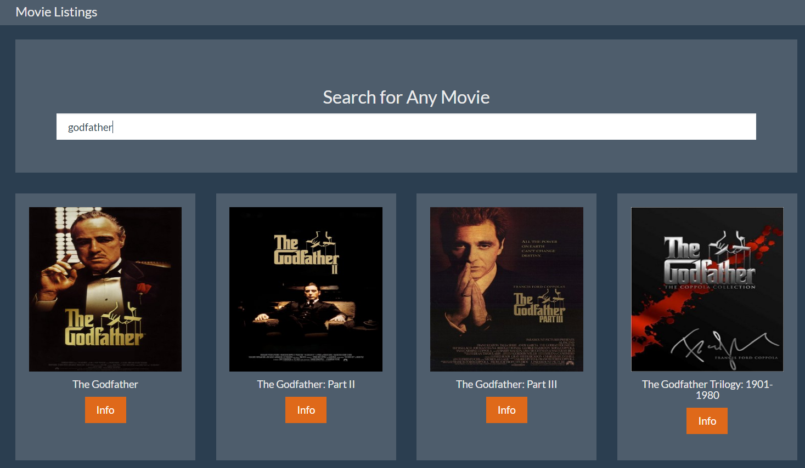
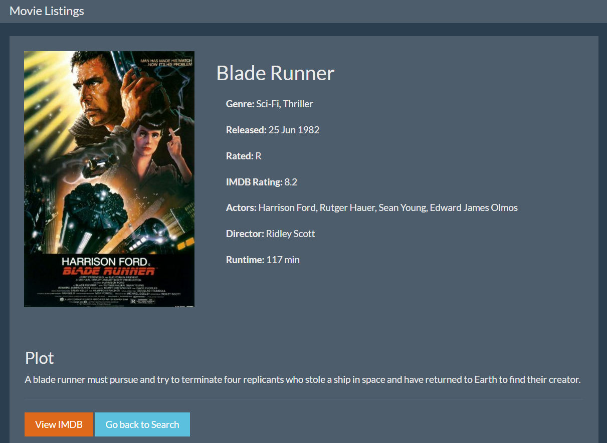

# Movie App

### Overview
A Movie Listings App that displays movies from user searches. Each movie has an Info button that displays more information and a link to its IMDB page.
Written using Javascript ES6 & jQuery and utilizing [Axios](https://www.npmjs.com/package/axios) to get data from the [OMDB API](http://www.omdbapi.com/).
The app is styled with this [Bootstrap Theme](https://bootswatch.com/superhero/).

The app was built with the help of this [Youtube Tutorial](https://www.youtube.com/watch?v=YsPqjYGauns).
The code for the tutorial is on [Github here](https://github.com/bradtraversy/movieinfo).

    index.html

    movie.html

## Usage
- Download the ZIP or clone the repo
- Run index.html
- or [click the demo](https://andrwsalcdo.github.io/movie-app/)
